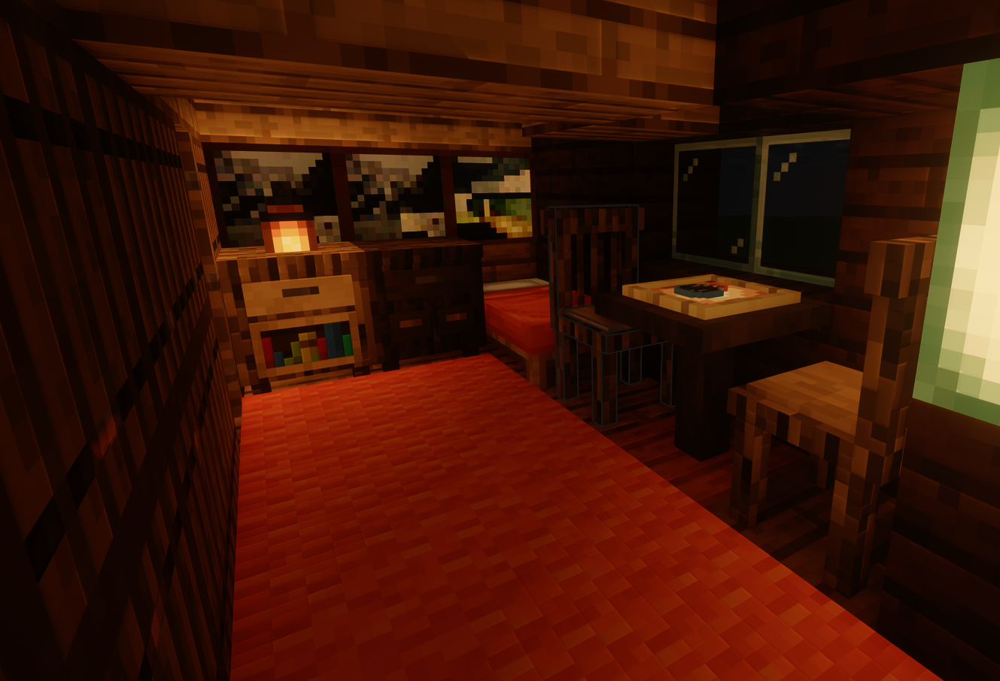

# F21CA-Games3: Minecraft Murder Mystery with LLM-Driven NPCs

This project was developed as part of the F21CA - Conversational Agents and Spoken Language Processing course at Heriot-Watt University, created by the 4th year Games3 group.

## Project Introduction

This is a fully voice-interactive murder mystery game built inside **Minecraft**, featuring **LLM-powered NPCs**, immersive narrative design, and real-time dialogue. Players interact naturally with NPCs to investigate a murder case aboard a luxury cruise ship and deduce the true culprit.

## Project Highlights

Built on **Minecraft Fabric 1.20.4** with Java 17 using the [**CreatureChat mod**](https://modrinth.com/mod/mcmti), this game transforms traditional gameplay into a fully voice-enabled mystery-solving experience.

- **LLM-Driven NPCs**  
  Each suspect is powered by **OpenAI GPT-4o**, configured with prompt engineering techniques including:
  - Chain-of-thought reasoning
  - Role-playing persona prompts
  - Counterfactual misleading
  - Unreliable narration (for the culprit)

- **Voice Interaction Pipeline**
  - **ASR (Speech-to-Text):** Microsoft Dictation for real-time transcription
  - **LLM Querying:** Azure OpenAI API for context-aware NPC responses
  - **TTS (Text-to-Speech):** Baidu TTS API for dynamic, emotional voice playback

- **Narrative Design & Gameplay**
  - Explore the cruise ship
  - Discover hidden clues
  - Interrogate suspicious characters
  - Track achievements and identify the murderer!

## Gameplay Flow

1. Learn the backstory from an in-game book
2. Explore the cruise ship and find evidence
3. Talk to 3 suspects with open-ended voice dialogue
4. Analyze contradictions and synthesize clues
5. Make your final accusation!

## Game Screenshots

### 1. Cruise Ship Exterior


### 2. Crime Scene (Storage Room)


### 3. Suspect Room (Interior)


## Gameplay Demo

[](https://youtu.be/tVd3QYc0fU8)


## Technologies Used

| Component | Tech |
|----------|------|
| Game Engine | Minecraft (Fabric 1.20.4) |
| LLM | GPT-4o via OpenAI API |
| ASR | Microsoft Dictation |
| TTS | Baidu TTS API |
| Modding | CreatureChat, PCL2 |
| Programming Languages | Java, Python |
| Prompt Techniques | CoT, Role-based, Emotion tagging |

## Characters & Roles

| Name      | Role             | Description |
|-----------|------------------|-------------|
| Emily     | Crew Member      | Victim of abuse and coercion |
| Sophia    | Singer           | Owes debt to the victim and harbors a secret |
| Michael   | Bar Manager      | Ex-partner in crime and the eventual murderer |
| David     | Victim (NPC)     | Abusive officer involved in drug trafficking |
| Christopher | Player Character | The Captain and game’s detective |

## Getting Started

> Requirements: **Minecraft Java Edition 1.20.4**, **Fabric mod loader**, and access to **Azure OpenAI** APIs.

1. **Clone this repository**  
   Download or clone the project to your local machine.

2. **Install Minecraft Fabric 1.20.4**  
   Set up [Fabric](https://fabricmc.net/) as your Minecraft mod loader. We recommend using [PCL2](https://github.com/Hex-Dragon/PCL2/releases) for ease of management.

3. **Add the correct version folder**  
   Place the `1.20.4-Fabric 0.16.10` folder into your `.minecraft/versions/` directory. This ensures Minecraft loads the correct environment.

4. **Configure API keys**  
   - Set your **OpenAI API key** for LLM queries (GPT-4o)  
   Configuration should be done in the CreatureChat mod settings or an external config file.

5. **Launch the game**  
   Start Minecraft using the Fabric profile, enter the world, and begin your investigation!

### API Key Setup

You will need valid API keys to connect the in-game NPCs to the LLM services.

#### Azure OpenAI API
You can obtain your OpenAI GPT-4o key via:
- [Azure for Students](https://azure.microsoft.com/en-gb/free/students)
- [Azure Portal](https://portal.azure.com)

#### In-Game Configuration
Once in Minecraft, press `T` to open the chat and configure the CreatureChat mod with the following commands:

```plaintext
creaturechat url set "YOUR_API_URL"
creaturechat key set "YOUR_API_KEY"
creaturechat model set gpt-4o
creaturechat timeout set 60
```

## Paper

Read our full technical report and evaluation results [here](assets/Design and Evaluation of LLM-Driven NPCs for a Minecraft Murder Mystery.pdf)

## Authors

- Jiangao Ma  
- Junlin Wu  
- Hanjing Wang  
- Shengyu Lu  
- Yi Ding  
- Ruotong Peng  
- Cheng Peng  
- Yusheng He  
- Ruoxuan Liu  
- Yifan Zheng  
- Lin Sun  

*Developed at Heriot-Watt University, F21CA Games3 Project*

## Contact

For questions or feedback, feel free to reach out:  
jm2075@hw.ac.uk, jw2054@hw.ac.uk

---

## License

This project is for academic and demonstration purposes. See [`LICENSE`](./LICENSE) for details.
