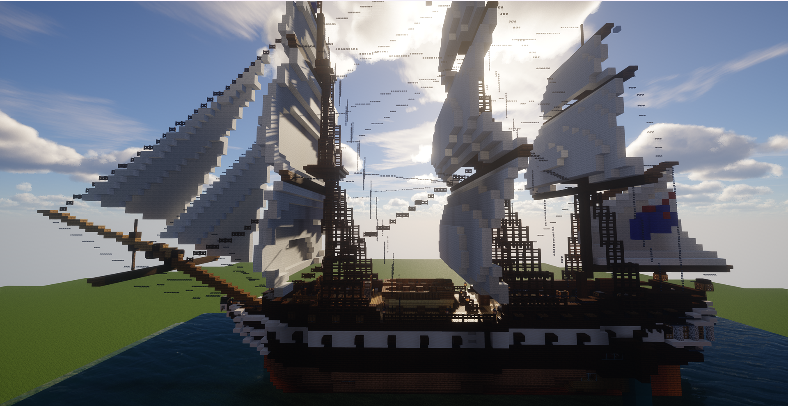

# F21CA-Games3: Minecraft Murder Mystery with LLM-Driven NPCs

This project presents a fully voice-interactive murder mystery game built inside **Minecraft**, featuring **LLM-powered NPCs**, immersive narrative design, and real-time dialogue. Players interact naturally with NPCs to investigate a murder case aboard a luxury cruise ship and deduce the true culprit.

## Project Highlights

- **Minecraft + AI Integration**  
  Built on **Minecraft Fabric 1.20.4** with Java 17 using the **CreatureChat mod**, this game transforms traditional gameplay into a fully voice-enabled mystery-solving experience.

- **LLM-Driven NPCs**  
  Each suspect is powered by **OpenAI GPT-4o**, configured with prompt engineering techniques including:
  - Chain-of-thought reasoning
  - Role-playing persona prompts
  - Counterfactual misleading
  - Unreliable narration (for the culprit)

- **Voice Interaction Pipeline**
  - **ASR (Speech-to-Text):** Microsoft Dictation for real-time transcription
  - **LLM Querying:** Azure OpenAI API for context-aware NPC responses
  - **TTS (Text-to-Speech):** Baidu TTS API for dynamic, emotional voice playback

- **Narrative Design & Gameplay**
  - Explore the cruise ship
  - Discover hidden clues
  - Interrogate suspicious characters
  - Track achievements and identify the murderer!

- **Evaluation**
  - Improved LLM accuracy, relevance, and emotional consistency to **100%**
  - 80% player success rate in identifying the correct suspect
  - User testing, questionnaires, and safety optimization included

## Gameplay Flow

1. Learn the backstory from an in-game book
2. Explore the cruise ship and find evidence
3. Talk to 3 suspects with open-ended voice dialogue
4. Analyze contradictions and synthesize clues
5. Make your final accusation!

## Game Screenshots

### 1. Crime Scene (Storage Room)

### 2. Suspect Room (Interior)

### 3. Cruise Ship Exterior

## Technologies Used

| Component | Tech |
|----------|------|
| Game Engine | Minecraft (Fabric 1.20.4) |
| LLM | GPT-4o via OpenAI API |
| ASR | Microsoft Dictation |
| TTS | Baidu TTS API |
| Modding | CreatureChat, PCL2 |
| Programming Languages | Java, Python |
| Prompt Techniques | CoT, Role-based, Emotion tagging |

## Characters & Roles

| Name      | Role             | Description |
|-----------|------------------|-------------|
| Emily     | Crew Member      | Victim of abuse and coercion |
| Sophia    | Singer           | Owes debt to the victim and harbors a secret |
| Michael   | Bar Manager      | Ex-partner in crime and the eventual murderer |
| David     | Victim (NPC)     | Abusive officer involved in drug trafficking |
| Christopher | Player Character | The Captain and game’s detective |

## Getting Started

> Note: This game requires **Minecraft Java Edition 1.20.4** and the **Fabric mod loader**.

1. Clone this repository
2. Set up Minecraft with [Fabric](https://fabricmc.net/) and [PCL2](https://github.com/HexoMod/PCL2)
3. Place the mod files inside your `.minecraft/mods` directory
4. Configure your API keys for OpenAI and Baidu TTS
5. Launch the game and start the investigation!

## Paper

Read our full technical report and evaluation results [here](./docs/minecraft_llm_npc_report.pdf) *(or link to arXiv, if applicable)*.

## Authors

- Jiangao Ma  
- Junlin Wu  
- Hanjing Wang  
- Shengyu Lu  
- Yi Ding  
- Ruotong Peng  
- Cheng Peng  
- Yusheng He  
- Ruoxuan Liu  
- Yifan Zheng  
- Lin Sun  

*Developed at Heriot-Watt University, F21CA Games3 Project*

## Contact

For questions or feedback, feel free to reach out:  
jm2075@hw.ac.uk, jw2054@hw.ac.uk

---

## License

This project is for academic and demonstration purposes. See [`LICENSE`](./LICENSE) for details.
